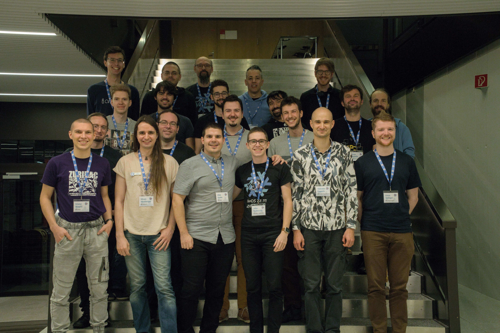
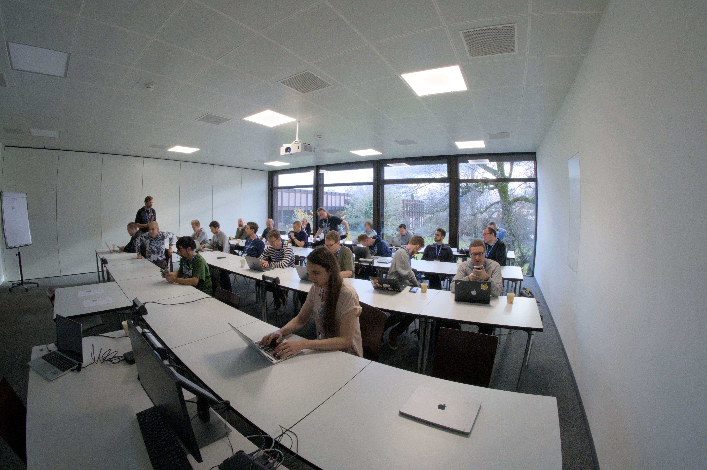
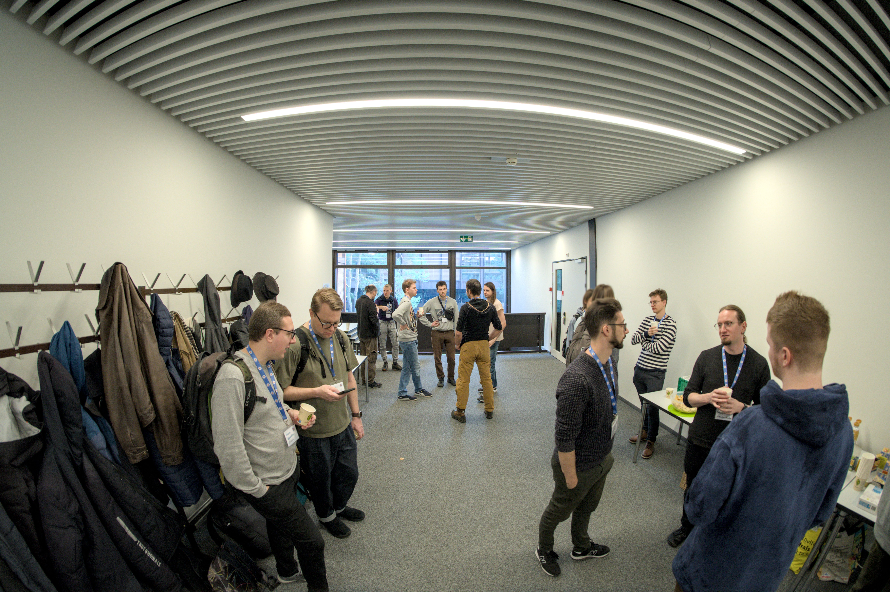
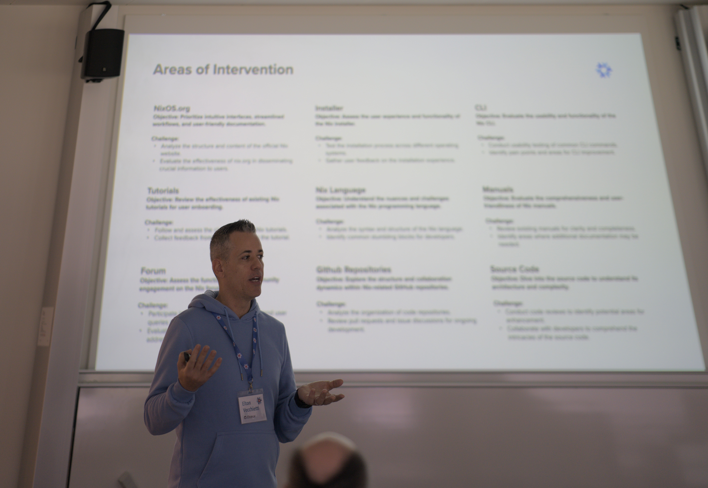
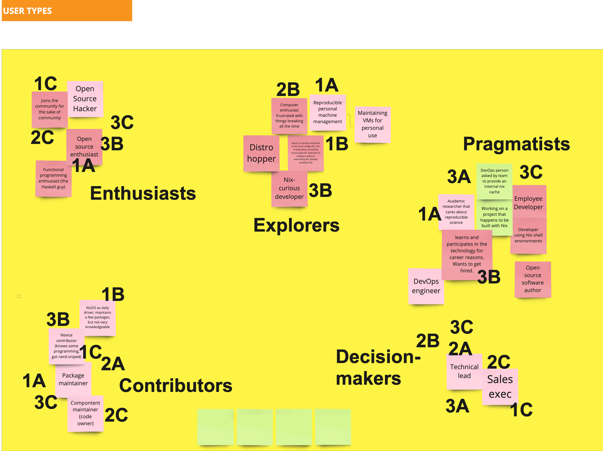
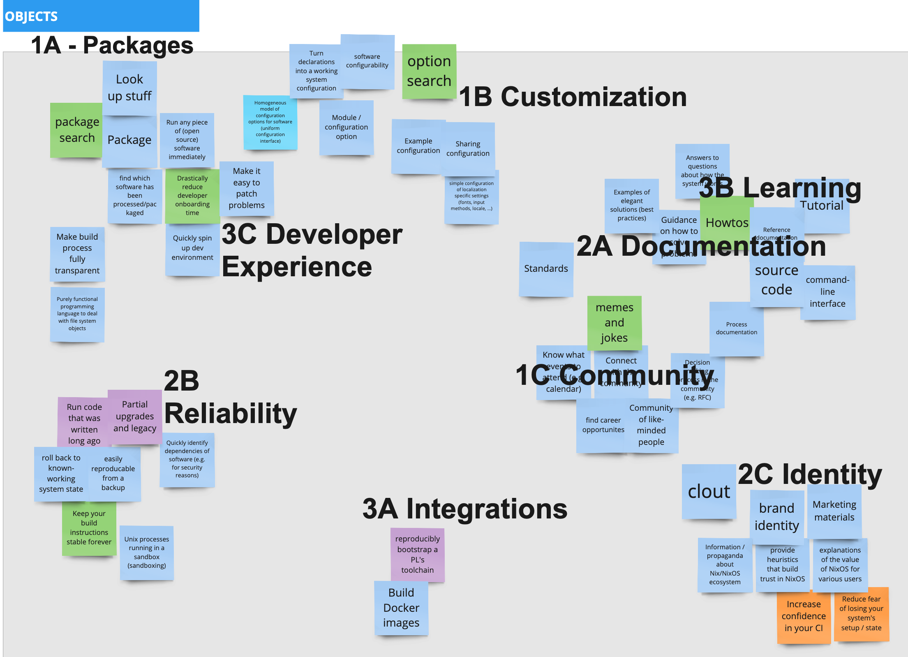
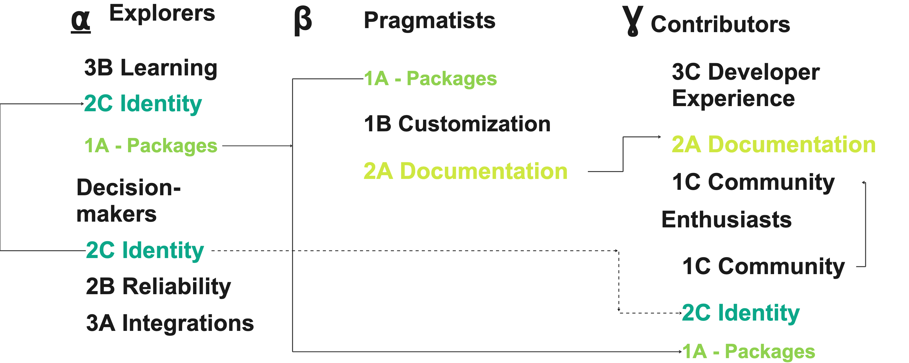
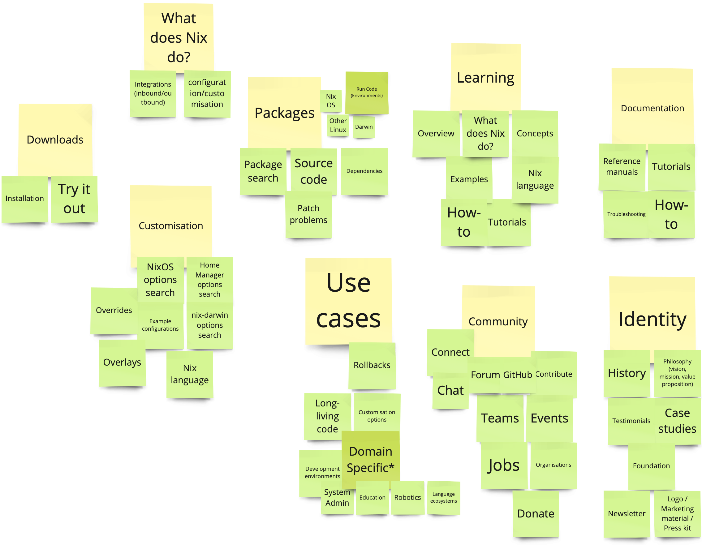

# Zürich 23.11 ZHF Hackathon and UX Workshop report

On the last weekend of November 2023, the Zürich Friends of Nix hosted a multi-event around the [Zero Hydra Failures release preparations for NixOS 23.11](https://discourse.nixos.org/t/lets-have-a-great-23-11-release-cycle/33765).
It featured a two-day hackathon and a UX workshop, that all took place at [Eastern Switzerland University of Applied Sciences](https://www.ost.ch/) (OST) right next to Lake Zürich.

# Background and preparations

The Nix ecosystem is growing, and so is the community building it.
This can also be felt in the now regular Zürich ZHF hackathon, which has seen more and more participants over time.
The event is designed to encourage people to get to know each other, hack on everything Nix, and shape the future of open source together.

On this third iteration, we incorporated feedback from last time as well as experiences from [NixCon 2023 in-person workshops](https://discourse.nixos.org/t/nixcon-governance-workshop/32705):
- More time for hacking and mingling
- Shorter workshop sessions
- A variety of brief talks for overview and inspiration
- Increased coffee throughput

Preparations started in June 2023, right after the event, by writing up a report, processing feedback, and sketching a schedule for the next event.
In the four months before the event, we invited many guests and followed up with reminders, refined the agenda, and prepared some of the logistics.
While originally there were plans to work on project governance topics, some key people couldn't make it to the workshop this time and it turned out that the schedule wouldn't have allowed for it anyway.

A brief survey of the 6-month-objectives from the last workshop showed that it wouldn't make sense to have a separate agenda item for those.
There is progress on a few of the objectives though:
- @zimbatm launched [Nix packaging as a service](https://discourse.nixos.org/t/beta-launch-nix-packaging-as-a-service/34683)
- The [commercial support page](https://nixos.org/community/commercial-support) on nixos.org got more specific with respect to which support services are offered
- @jeremiahs is developing a plan to implement a [CIS benchmark](https://www.cisecurity.org/cis-benchmarks) and configuration profile for NixOS
- [RFC 140 got merged](https://media.ccc.de/v/nixcon-2023-35713-not-all-packages-anymore-nix) and @infinisil worked on [better tooling to work with local files in derivations](https://www.tweag.io/blog/2023-11-28-file-sets/)

# Event

The event took place in two large rooms and the hallway, and spanned two days, starting Saturday at 10:00 and ending at 19:00 with a group photo, and continuing on Sunday at 10:00 until it phased out around 17:00.

We had around 35 attendees on Saturday and 25 on Sunday, arriving from all over Europe, and we were glad to meet both first-time participants as well as regulars.
In addition to all the people giving presentations, we were particularly happy to welcome NixOS Foundation board member @zimbatm, @delroth from the infrastructure team, `niv` author @nmattia, and many others.

# Lightning talks

At the beginning of each day we had guests highlighting recent developments in the ecosystem in brief talks.

On Saturday:
- Alex (@ners) welcomed everyone and provided an overview of the two following days
- Valentin (@fricklerhandwerk) gave a brief update on recent work in Nix maintenance and documentation
- Elton (@EltonUX) summarised the last two workshop sessions ([November 2022](https://discourse.nixos.org/t/2022-11-26-nix-nixpkgs-nixos-hackathon-in-zurich-rapperswil-jona/23402/11) and [May 2023](https://discourse.nixos.org/t/zurich-23-05-zhf-hackathon-and-workshop-report/29093)), and gave taste of what would expect participants this time
- Ivan (@iminicik) and Auguste (@augustebaum) reported on their mob programming experience with Summer of Nix
- Silvan (@infinisil) made his traditional introduction to working on ZHF

On Sunday:
- Ivan (@imincik) introduced the [Nixpkgs geospatial software maintainer team](https://discourse.nixos.org/t/creating-nix-geospatial-team/23454) he founded
- Matthias (@mat) brought our attention to how commercial interests impact community dynamics in open source

# ZHF Hackathon

Before and after the talks in the morning, there was plenty of time for introductions or catching up.
Plenty of coffee, fresh vegan sandwiches and wraps, and λ shaped cookies were waiting in the hallway.

Snacking was accompanied by hacking, in which most of the attendees participated this time.
@infinisil was available to assist beginners and experts alike with navigation and debugging.
People worked on a range of issues, from trivial typos, over cursed Python environments, to surprisingly deep issues with the Nixpkgs `stdenv` infrastructure and hard-coded limitations in Hydra.
Over the weekend, [22 ZHF pull requests](https://github.com/NixOS/nixpkgs/issues?q=ZurichZHF+created%3A%3E2023-11-24) were opened and most of them got merged.

# UX workshop

This was the third iteration of the Nix UX workshop led by Elton Vecchietti, Director of UX at Modus Create.

In the first event a year ago, the group had outlined a typical user journey, tracing interactions across a sequence of touchpoints.
In the second event half a year ago, we compared Nix to similar tools, framed processes in the ecosystem in terms of resource flows, and tried to distill central value propositions.
This time, the goal was to come up with an information architecture for the central hub of the ecosystem, with the intention of supporting the Nix marketing team in their ongoing effort to rework nixos.org.

In three sessions spread out over two days, guided by Elton and building on the understanding gathered so far, a group of 5-10 people tried to systematically answer three major questions:

1. Which user types do we support?
2. Which objects of interest do they interact with?
3. Which topics connect user types and objects of interest?

Notably, the workshop focused on content rather than presentation.
To make a point about the difference, Elton presented an alternative skin for the current contents of nixos.org his UX team had prepared.
As a warm-up, we contrasted that with the current design and that of landing pages of projects we had compared Nix with in the last workshop.

## User types

The first assignment was to collect user types we can identify from our experience, and validate them within the group of participants.
This brought about terms such as:
- Open source hacker
- Linux enthusiast
- Nix-curious developer
- Package maintainer
- Academic researcher
- Employee developer
- DevOps engineer
- Sales executive
- ...

Each of the labels got a verbal explanation that was confirmed by the group, sometimes accompanied by a written comment on the digital sticky notes.

After that, participants were asked to cluster these user types.
When we came back to this panel to map these clusters to the objects of interest found in the second assignment, they were also labeled:
- Enthusiasts
- Explorers
- Pragmatists
- Contributors
- Decisionmakers

## Objects of interest

The second assignment was to determine objects of interaction in the ecosystem, with the ultimate goal to provide short and obvious navigation paths to the most important ones in the information architecture we were working towards.

The group struggled a bit with untangling objects from their properties and acting on the objects, but eventually came up with items such as:
- Package
- Option search
- Example configuration
- Development environment
- Build instructions
- Tutorial
- Command-line interface
- Source code
- Brand identity
- ...

Again, each item was explained verbally and sometimes annotated or reworded for clarity.

The collection was then clustered by topic (letters A-C) and prioritised (numbers 1-3):
- 1A Packages
- 1B Customisation
- 1C Community
- 2A Documentation
- 2B Reliability
- 2C Identity
- 3A Integrations
- 3B Learning
- 3C Developer experience

At the end of the first day and as a preparation for distilling the key topics in the last workshop session, the group mapped object clusters to the clusters of user types that interact with them.
Then we tried to find the three most important user types and the objects they interact with, which revealed the overlap and hints at which objects may end up to be more prominent in the information architecture.

## Topics

On the second workshop day, with a smaller group due to participants' time constraints (and also some exhaustion from the first two sessions), we re-evaluated the collections of user types and objects and were tasked to find 9 topics and refine the objects of interests that belong to these topics, but without a particular order.

The following topics were identified:
- Downloads
- Use cases
- Packages
- Customisation
- What does Nix do?
- Learning
- Documentation
- Community
- Identity

The result was presented to the group of ZHF hackers in the other room for a quick validation, which added a few items to the overview.

## Summary

While at times it felt like hair splitting over terms and definitions, and the fast pace necessitated glimpsing over some inaccuracies, the procedure was highly organised and produced new insights for participants.
One of them is how Nix is at the nexus between different ecosystems, wrapping artifacts of some (e.g. software builds, Git or Vim configurations, service definitions) and producing artifacts for others (e.g. Unix user environments, Linux distributions, Docker images, virtual machine images).

Elton pointed out that the kind of process we went through in three weekends usually takes somewhere around six weeks and involves all stakeholders of an organisation, so we can consider it as a glimpse of what's possible.
Therefore it's not surprising that these and the past sessions really felt like work, and that with Elton's guidance and in a short amount of time we still have achieved a great increase of clarity that was otherwise unavailable.

Some of the topics, user types, and objects of interest we discussed and compiled are already represented on nixos.org, nix.dev, and Discourse, with varying degrees of structure.
For example, nixos.org shows where to get in touch with the community, nix.dev offers learning materials and links to documentation, and there is a job board on Discourse.
The workshop results also highlight gaps as well as opportunities to adjust emphasis to better accommodate the user needs we have identified in all of these sessions.
We hope that these results will help the Nix marketing team and the community to keep improving our systems of communication.

A next step for the UX workshop would be developing relations between the various topics, as well as wireframes, abstract models of a graphical representation; both aiming to arrive at relative priorities and sequence of presentation.
As always, everyone is invited to take part!

As a follow-up to this workshop, together with the Nix marketing team we want to prepare a survey to validate and refine our results with everyone in the community, so stay tuned for updates.

# Acknowledgements

This event was made possible by Prof. Dr. Farhad Mehta, professor of informatics at the OST, by accommodating us in two large, modern computer rooms with a beautiful lake view.
Thanks a lot to Raffael Das Gupta (@das-g) for your support with the venue.
The event was sponsored by the NixOS Foundation, providing budget for food and drinks.
Tweag, the Modus Create Open Source Program Office lead by Mathieu Boespflug (@mboes), enabled Elton Vecchietti (@eltonUX) to run the UX workshop and provided us with the unique opportunity to learn from a world-class expert.

Thanks to all the participants for your attendance and active involvement, and for providing [detailed feedback on the event](https://github.com/nix-community/developer-workshop/issues/3) so we can make it even better next time.

# Looking ahead

We’re already set to organise the next event to keep up the momentum.
Save the date:

> Saturday 25th and Sunday 26th of May 2024

Looking forward to more hacking, snacking, knowledge sharing, and improving Nix for everyone!
We hope to meet many more leading contributors from the Nix ecosystem, better learn to know each other, and work on hard problems together.
Subscribe to [`nix-community/developer-workshop`](https://github.com/nix-community/developer-workshop) to stay up to date with planning and preparations.
