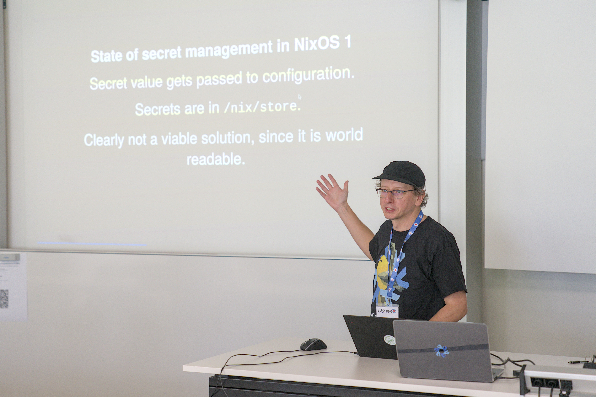
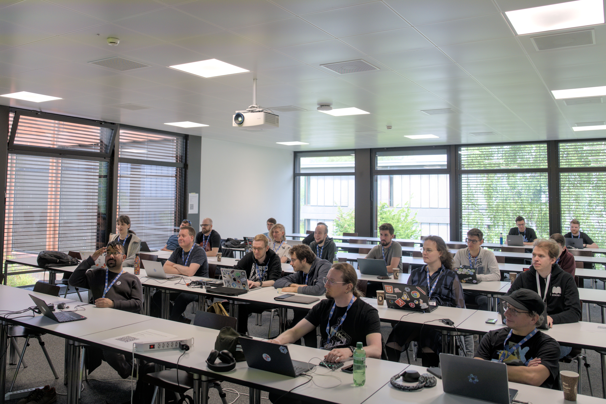
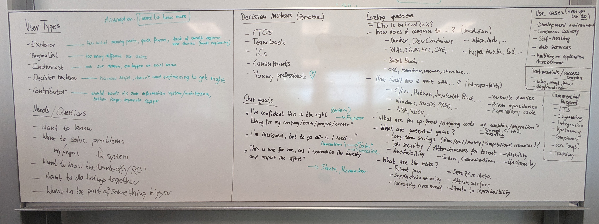

On the last weekend of May 2025, the Zürich Friends of Nix hosted the sixth two-day event at [Eastern Switzerland University of Applied Sciences](https://www.ost.ch/) (OST) right next to Lake Zürich.
These events are designed to encourage people to get to know each other, hack on everything Nix, and shape the future of open source together.

This time we were slightly surprised by the [NixOS release team](https://nixos.org/community/teams/nixos-release/) around @leona doing a particularly great job and actually [releasing NixOS 25.05 in May 2025](https://discourse.nixos.org/t/nixos-25-05-released/64669).
At the size of Nixpkgs, luckily there were still enough [build failures waiting to get fixed](https://zh.fail/) to fuel a wholesome hackathon.

## Background and preparations

Preparations started two months after the previous hackathon, by continuing the tradition of publishing [an extensive report](https://discourse.nixos.org/t/zurich-24-11-zhf-hackathon-report/59250), evaluating feedback, and coming up with ideas for how to make the next one still better.

This time, apart from identifying and repeating what worked particularly well in the past, we tried to focus even more on enabling people to get together and collaborate, and beginners to get guidance and help.

## Event

The event took place in two large classrooms and the hallway connecting them, on Saturday 9:00-17:00 and Sunday from 10:00 to 17:00.
There were around 35 attendees on Saturday and more than 20 on Sunday, arriving from Switzerland and all over Europe.

We were excited to welcome numerous people new to either Nix or the Zürich crowd, and had happy reunions with regulars @infinisil @imincik @gefla @Nebucatnetzer @das-g and many more.
We especially appreciated having as first-time guests @lassulus @ibizaman @avocadoom @kiara.

On Saturday there was a flurry of impromptu lightning talks:
- Alex (@ners) welcomed attendees
- Valentin (@fricklerhandwerk) presented the [Nixpkgs Security Tracker](https://tracker.security.nixos.org/) and [NGIpkgs](https://ngi.nixos.org/)
- Kiara (@kiara) gave an overview of the [Fediversity project](https://fediversity.eu)
- @lassulus made a quick tour of [Vars](https://clan.lol/blog/vars/) and [nix-select](https://git.clan.lol/clan/nix-select)
- Ivan (@imincik) demonstrated the design experiment [`app-shell`](https://github.com/imincik/app-shell/)
- Lorenz (@lorenzbischof) reported on [sandboxing in Devenv with Landlock](https://github.com/cachix/devenv/pull/1783)

Having everyone equipped with NixOS T-shirts, Saturday's hacking ended with the customary group photo after barbecue at the lake.
On Sunday the hacking continued with a smaller but not any less motivated group, and another round of barbecue (complemented by a vegan fried rice option).

- @infinisil once again roamed around to help various people debugging their builds, but also somehow managed to continue NixCon 2025 preparations with @ners and @lassulus.
- @ners put together a system to generate vouchers for contributors and tested it with attendees, eventually leading up to the [launch of NixCon ticket sales](https://discourse.nixos.org/t/ticket-sales-started-for-nixcon-2025/64756) (don't forget to get yours as long as they're available!).
- @l0b0 followed the [ZHF hacking instructions](https://docs.google.com/presentation/d/1qwIU_qe9nTJL3csTETDhLrz3rC7EjPqxFPl_Gpsx6No/edit?slide=id.g198b911f5a4_0_15#slide=id.g198b911f5a4_0_15) to migrate to NixOS 25.05
- @kiara and @fricklerhandwerk clarified [the data model behind use cases Fediversity intends to enable](https://pad.lassul.us/8Ecys_66QaW3ZAlb9FzzxQ?both)
- @das-g [packaged Apache Hop](https://github.com/NixOS/nixpkgs/pull/397937)
- @Nebucatnetzer worked on [adding syslog support and documentation to the LibreNMS module](https://github.com/NixOS/nixpkgs/pull/410533)
- @lassulus @infinisil @fricklerhandwerk exchanged updates on what's going on around the NixOS Foundation, including our [NGI collaboration](https://nixos.org/community/teams/ngi/) and other projects

Over the weekend, the group [created 22](https://github.com/search?q=org%3ANixOS+ZurichZHF+created%3A2025-05-24..2025-05-26&type=pullrequests) and [closed 16](https://github.com/search?q=org%3ANixOS+ZurichZHF+closed%3A2025-05-24..2025-05-26&type=pullrequests) issues or pull requests.
Over the entire event series we're currently at [133 created](https://github.com/search?q=org%3ANixOS+ZurichZHF+created%3A%3C2025-05-28&type=pullrequests) and [123 concluded](https://github.com/search?q=org%3ANixOS+ZurichZHF+closed%3A%3C2025-05-28&type=pullrequests) contributions.

## NixOS landing page design

On Saturday a crowd gathered around @avocadoom to unpack what's there to be done around [improving the design of the nixos.org website](https://discourse.nixos.org/t/redesigning-nixos-org-our-vision-for-2025/63882).
We rehashed results of past UX workshops -- especially the [elaboration on user types](https://discourse.nixos.org/t/zurich-23-11-zhf-hackathon-and-ux-workshop-report/37848#p-131258-user-types-6) and [conclusions from the 2024 survey](https://discourse.nixos.org/t/ux-design-for-the-nix-portal/53746/3) -- to converge on a general direction and implementation strategy.

@fricklerhandwerk and @avocadoom followed up in the evening:
- We generally agreed on the assessments from the past workshops, especially user types and their different needs and roles in the ecosystem.
- We want to take an incremental approach that shouldn't disrupt existing workflows, and pick a narrow focus where we can show results in reasonable time.

  It's always been a serious challenge to figure out where to even start when we're constantly getting everything at once into scope.
  We'll leave the landing page as it is for now, and put new user stories side by side.
- For an initial deliverable, build user stories for one user type in a way that doesn't overlap with other user journeys so that it's easier to keep untangled from unrelated concerns.

On Sunday @steveej joined @avocadoom and @fricklerhandwerk to develop an outline of the "decision maker" journey, which we deemed to have the best ratio of implementation effort to impact at the moment.
We stress-tested the proposal with @gefla, who brilliantly played all user personae at once and provided invaluable feedback.
The plan is to continue collaborating on the subject asynchronously.

@avocadoom also fixed a number of [small usability and accessibility issues](https://github.com/NixOS/nixos-homepage/pulls?q=is%3Apr+merged%3A2025-05-24..2025-05-26+involves%3Athilobillerbeck+).

# NixOS module interfaces

As a kind of follow-up to the [deployment systems exchange](https://discourse.nixos.org/t/zurich-24-11-zhf-hackathon-report/59250#p-197228-deployment-systems-exchange-4) half a year ago, @ibiziaman @fricklerhandwerk @kiara @lassulus came together to distill a pattern encountered in multiple efforts revolving around NixOS:
- [SelfHostBlocks](https://github.com/ibizaman/selfhostblocks/) by @ibizaman
- [modular services](https://github.com/NixOS/nixpkgs/pull/372170) by @roberth
- [Vars](https://github.com/NixOS/nixpkgs/pull/370444) by @lassulus et al.
- [Fediversity](https://git.fediversity.eu/) developed by @niols @kiara @fricklerhandwerk
- [NGIpkgs](https://ngi.nixos.org) maintained by @eljamm @imincik et al.

The idea is illustrated in @ibizaman's pre-RFC proposal to [decouple NixOS service components](https://discourse.nixos.org/t/pre-rfc-decouple-services-using-structured-typing/58257) and was [presented at NixCon 2024](https://www.youtube.com/watch?v=CP0hR6w1csc):
Try being more clever with the modules' type system by adding what amounts to a "modular" function type.
This would allow separating interfaces from implementations when computing configuration values.

And it's an important thing to get right!
All of these projects are promising to substantially improve both user and contributor experience for NixOS: 
- Modular services and Vars are concrete examples where specifying the interfaces more explicitly would help with both code readability for maintainers and reduce effort for implementation authors.
- Fediversity and NGIpkgs will both soon run into the acute need to provide multiple implementations in order to enable deployment variants and manageable integration tests.
- SelfHostBlocks is building an entire collection of modules that are composed using such interfaces, but so far was lacking a concise, reusable implementation of its underlying idea.

Two half-afternoons of intense hacking, agonizing over inscrutable stack traces, `infinite recursion encountered`, and plain-dumb typos later, we're proud to present *module interfaces*:

https://github.com/fricklerhandwerk/module-interfaces

It's enabled by @nbp's original genius and (among a few others) @roberth's thoughtful maintenance of the dark magic that is The Module System:
Equipped with its unique combination of global merge semantics and [dependent types](https://en.m.wikipedia.org/wiki/Dependent_type), it is now complemented with its own, worthy notion of type-safe function application.

Check the [example](https://github.com/fricklerhandwerk/module-interfaces/blob/zhf/example/default.nix) to get a feeling for how it's used.
The consumer-input-provider-output-interface terminology still borrows from @ibizaman's proposal, but may be more appropriately framed with apply-argument-function-value-type.
We already [sketched](https://github.com/fricklerhandwerk/module-interfaces/pull/2) a way to address @Atemu's comment on [accommodating provider-specific parameters](https://discourse.nixos.org/t/pre-rfc-decouple-services-using-structured-typing/58257/10).

The next step would be to implement the module system equivalent of [effects](https://en.wikipedia.org/wiki/Effect_system).
That would be required to support the Vars use case, where the consumer would input parameters, the provider would return the path to a secret as a pure value, but also generate an `activationScript` entry as a side effect.
Idea: `config`, from the module argument of the consumer, acts as the context passed through together with the input to the provider, and is retrieved together with the output to be attached as the `config` attribute of the consumer which contributes to the final evaluation result.

50 years of programming language theory research into pure languages and type theory have not been in vain.
Pull requests welcome!

## Acknowledgements

This event was made possible by Prof. Dr. Farhad Mehta (@fmehta), professor of informatics at the OST, by accommodating us in a large, modern computer room with a beautiful lake view.

This event wouldn't be possible without the amazing event team around @ners and @john-rodewald and @das-g tending to the venue.

[Tweag](https://tweag.io), the Modus Create Open Source Program Office lead by Mathieu Boespflug (@aherrmann), and [Antithesis](https://antithesis.com), thanks to their ongoing sponsoring, enabled @fricklerhandwerk and @infinisil respectively to participate as part of their work on the Nix ecosystem.

Thanks to all the participants for making this such a memorable event.

And last but not least, many thanks to NixOS 25.05 release managers @leona and @tristanross for another great edition of our favorite Linux distribution!

# Looking ahead

The next ZHF hackathon in Zürich is already on the horizon, save the date:

> Saturday 29th and Sunday 30th of November 2025

We hope to meet all of you again, but only after [NixCon 2025 September 5-7](https://2025.nixcon.org/) at the same venue!

> For up-to-date information, check the [Nix Zürich user group](https://zurich.nix.ug/) website.

You can also follow news shared on these channels:
- Nix Zürich Matrix room at [#zurich:nixos.org](https://matrix.to/#/#zurich:nixos.org)
- [Zürich friends of Nix at meetup.com](https://www.meetup.com/nix-zurich/)
- [`nix-community/ZurichZHF`](https://github.com/nix-community/ZurichZHF)

Find more Nix events in the [NixOS Discourse *Events* category](https://discourse.nixos.org/c/events/13).
